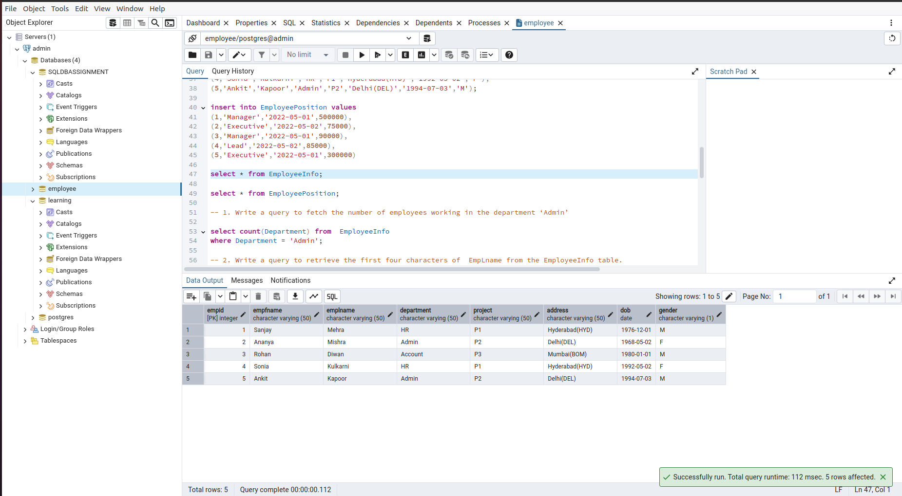
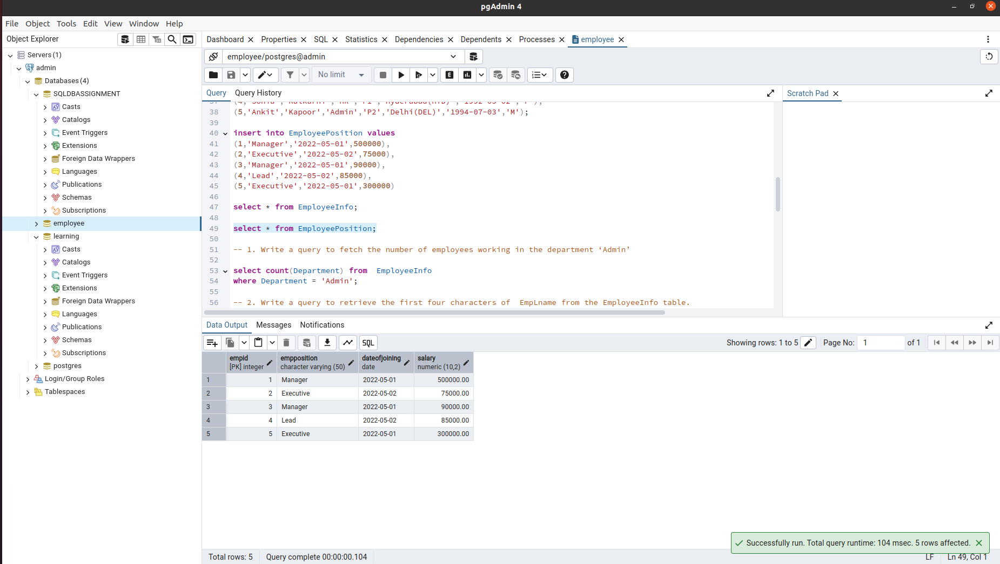

# Database
- Database Architecture

### Database Architecture
- T1 Architecture
- T2 Architecture
- T3 Architecture


# SQL Assignment

## Database Setup

### Create Database
```
-- Create Employee Database
CREATE DATABASE employee
    WITH
    OWNER = postgres
    ENCODING = 'UTF8'
    LC_COLLATE = 'en_IN'
    LC_CTYPE = 'en_IN'
    TABLESPACE = pg_default
    CONNECTION LIMIT = -1
    IS_TEMPLATE = False;
```

### Create Tables

```
-- Create EmployeeInfo Table
CREATE TABLE EmployeeInfo (
    EmpID int PRIMARY KEY,
    EmpFname varchar(50) NOT NULL,
    EmpLname varchar(50) NOT NULL,
    Department varchar(50) NOT NULL,
    Project varchar(50) NOT NULL,
    Address varchar(50) NOT NULL,
    DOB DATE NOT NULL,
    Gender varchar(1) NOT NULL
);

-- Create EmployeePosition Table
CREATE TABLE EmployeePosition (
    EmpID int PRIMARY KEY REFERENCES EmployeeInfo(EmpID) ON DELETE CASCADE,
    EmpPosition varchar(50) NOT NULL,
    DateOfJoining DATE NOT NULL,
    Salary numeric(10,2)
);
```

### Insert  Data

```sql
-- Insert Data into EmployeeInfo Table
INSERT INTO EmployeeInfo VALUES
(1, 'Sanjay', 'Mehra', 'HR', 'P1', 'Hyderabad(HYD)', '1976-12-01', 'M'),
(2, 'Ananya', 'Mishra', 'Admin', 'P2', 'Delhi(DEL)', '1968-05-02', 'F'),
(3, 'Rohan', 'Diwan', 'Account', 'P3', 'Mumbai(BOM)', '1980-01-01', 'M'),
(4, 'Sonia', 'Kulkarni', 'HR', 'P1', 'Hyderabad(HYD)', '1992-05-02', 'F'),
(5, 'Ankit', 'Kapoor', 'Admin', 'P2', 'Delhi(DEL)', '1994-07-03', 'M');

-- Insert Data into EmployeePosition Table
INSERT INTO EmployeePosition VALUES
(1, 'Manager', '2022-05-01', 500000),
(2, 'Executive', '2022-05-02', 75000),
(3, 'Manager', '2022-05-01', 90000),
(4, 'Lead', '2022-05-02', 85000),
(5, 'Executive', '2022-05-01', 300000);
```

### Sample Data Preview

```sql
-- Select all records from EmployeeInfo Table
SELECT * FROM EmployeeInfo;

-- Select all records from EmployeePosition Table
SELECT * FROM EmployeePosition;
```
### EmployeeInfo : 


### EmployeePosition :

---

## SQL Queries

### 1. Fetch the Number of Employees in 'Admin' Department

```sql
SELECT count(Department) 
FROM EmployeeInfo
WHERE Department = 'Admin';
```

### 2. Retrieve the First Four Characters of Employee's Last Name

```sql
SELECT EmpLname, LEFT(EmpLname, 4) 
FROM EmployeeInfo;
```

### 3. Find Employees Whose Salary is Between 50,000 and 100,000

```sql
SELECT eif.EmpFname, eif.EmpLname, epos.Salary
FROM EmployeePosition AS epos
JOIN EmployeeInfo AS eif ON eif.EmpID = epos.EmpID
WHERE epos.Salary BETWEEN 50000 AND 100000;
```


### 4. Find Employees Whose First Name Begins with 'S'

```sql
SELECT EmpFname 
FROM EmployeeInfo
WHERE EmpFname LIKE 'S%';
```


### 5. Fetch Top N Records Ordered by Salary (Top 3 Records Example)

```sql
SELECT * FROM EmployeePosition
ORDER BY Salary DESC
LIMIT 3;
```


### 6. Exclude Employees with First Names "Sanjay" and "Sonia"

```sql
SELECT * 
FROM EmployeeInfo
WHERE EmpFname NOT IN ('Sanjay', 'Sonia');
```


### 7. Department-wise Count of Employees Sorted by Employee Count

```sql
SELECT Department, COUNT(*) AS empCount 
FROM EmployeeInfo
GROUP BY Department
ORDER BY empCount ASC;
```

### 8. Create an Index for a Particular Field and Show Data Fetching Difference

#### Before Index Creation

```sql
SELECT empID, empFname 
FROM EmployeeInfo
WHERE Department = 'Admin';
```


#### After Index Creation

```sql
-- Create Index on empID and empFname
CREATE INDEX idx 
ON EmployeeInfo (empID, empFname);


-- Query After Index Creation
SELECT empID, empFname 
FROM EmployeeInfo
WHERE Department = 'Admin';
```


